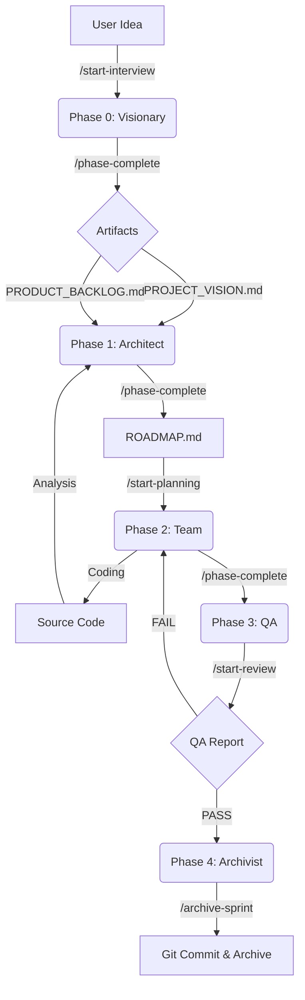

# The Agile Pipeline Workflow

This document describes how data flows through the AI-Assisted Scrum Framework.

## Detailed Steps

### 1. Inception (Visionary)
*   **Goal:** Clarity.
*   **Input:** User Chat.
*   **Output:** `agile/artifacts/PROJECT_VISION.md`, `agile/artifacts/PRODUCT_BACKLOG.md`.

### 2. Architecture (Architect)
*   **Goal:** Feasibility & Slicing.
*   **Input:** Backlog & Source Code.
*   **Action:** Analysis of technical debt and dependencies.
*   **Output:** `agile/artifacts/ROADMAP.md`.
*   **Key Logic:** Sprints are sliced by **Token Count**, not just time, to ensure the AI can handle the context.

### 3. Sprint Cycle (Team)
*   **Goal:** Implementation.
*   **Input:** Roadmap.
*   **Workspace:** `agile/pipeline/02_sprint/`.
*   **Action:**
    1.  Copy Template -> `SPRINT_BACKLOG.md`.
    2.  Task Breakdown.
    3.  Code Editing (No Commits!).

### 4. Quality Gate (QA)
*   **Goal:** Verification.
*   **Input:** Code & DoD.
*   **Workspace:** `agile/pipeline/03_review/`.
*   **Action:** Run Tests. Check Definition of Done.

### 5. Release (Archivist)
*   **Goal:** Finalization.
*   **Input:** QA Report (PASS).
*   **Action:**
    1.  `git add .`
    2.  `git commit -m "Sprint N: ..."`
    3.  Move `02_sprint` content to `agile/archive/sprint_N`.
