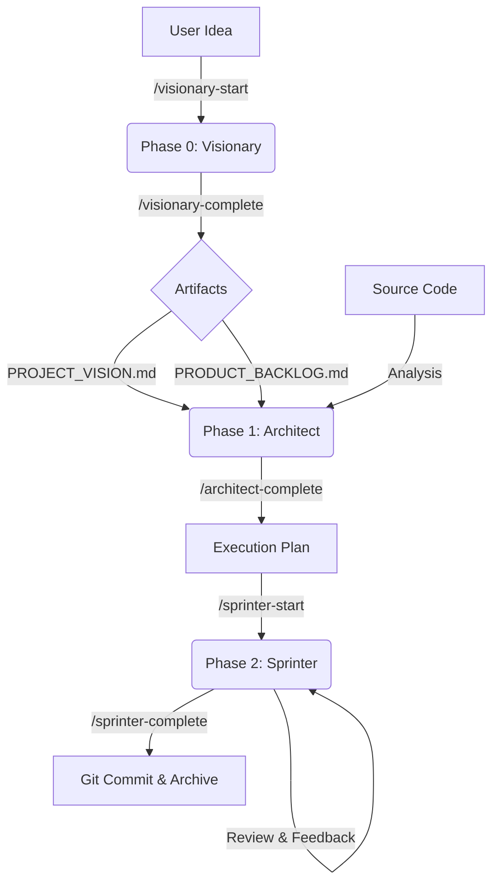

# The Agile Pipeline Workflow

This document describes how data flows through the AI-Assisted Scrum Framework.

## Detailed Steps

### 1. Inception (Visionary)
*   **Goal:** Clarity.
*   **Input:** User Chat.
*   **Output:** `agile/artifacts/00_inception/PROJECT_VISION.md`, `agile/artifacts/00_inception/PRODUCT_BACKLOG.md`.

### 2. Architecture (Architect)
*   **Goal:** Feasibility & Slicing.
*   **Input:** Backlog & Source Code.
*   **Action:** Analysis of technical debt and dependencies.
*   **Output:** `agile/artifacts/01_architecture/PRODUCT_BACKLOG.md` (Execution Plan).
*   **Key Logic:** Sprints are sliced by **Token Count**, not just time.

### 3. Sprint Cycle (Sprinter)
*   **Goal:** Autonomous Implementation & Delivery.
*   **Input:** Execution Plan (from Phase 1).
*   **Workspace:** `results/` (Code) & `agile/artifacts/02_sprint/` (Docs).
*   **Action:**
    1.  `/sprinter-start`: Initializes the Sprint Backlog.
    2.  **Implementation Loop:**
        *   Write Code in `results/`.
        *   Run Tests (autonomously).
        *   Ask User for Feedback.
    3.  **Completion:**
        *   `/sprinter-complete` triggers the QA Report (`SPRINT_REPORT.md`).
        *   Executes `git commit`.
